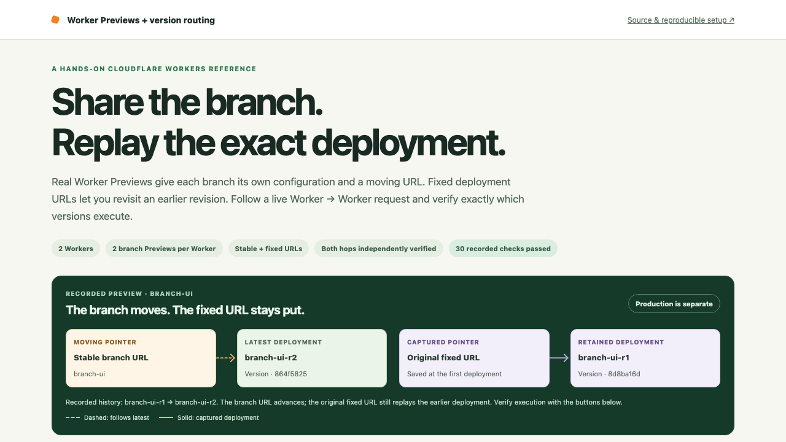
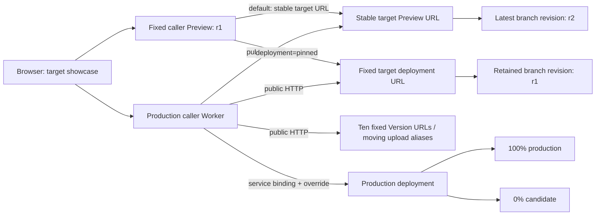
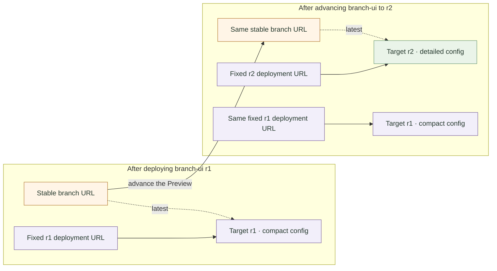
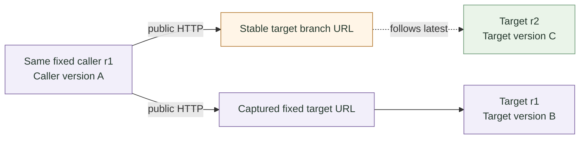
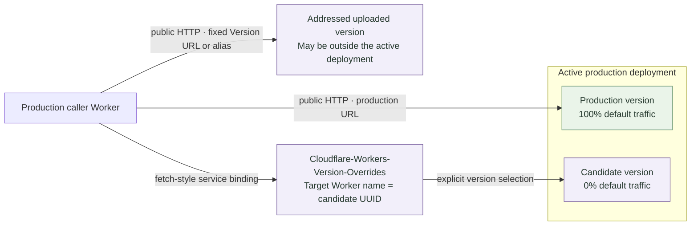

# Worker Previews + Exact Version Pinning

[](https://github.com/Gryczka/cloudflare-worker-version-routing/actions/workflows/ci.yml)
[](LICENSE)

> Share a branch, replay an earlier deployment, and prove which versions execute at both hops of a real Worker → Worker request.

**[Live demo](https://pin.gryczka.dev/)** · **[Caller API](https://probe.gryczka.dev/probe)**



The hosted demo runs this reference's two neutral Workers. The public configuration is account-independent; deployment helpers discover your subdomain and keep ownership, captured URLs, and verification receipts in an ignored local manifest.

**Status:** A reference implementation shared as-is, with best-effort support through [GitHub Issues](https://github.com/Gryczka/cloudflare-worker-version-routing/issues). It is not actively maintained.

## What You Can Verify

The bootstrap creates `branch-ui` and `branch-api` Previews for both caller and target. It deploys `branch-ui-r1`, advances that same Preview to `r2`, and checks the original fixed caller again.

| Request | Guarantee | Demonstrated result |
| --- | --- | --- |
| Production target | Preview updates do not promote code | Production identity stays unchanged during the Preview phase |
| Stable `branch-ui` URL | Follows the latest deployment in that Preview | Returns r2 and its detailed configuration |
| Fixed r1 target URL | Replays one captured Preview deployment | Still returns r1 and its compact configuration |
| Fixed r1 caller → stable target | Only the caller is pinned | Same caller ID, now calling target r2 |
| Same fixed r1 caller → fixed r1 target | Both executable deployments are pinned | Original caller ID and original target ID |
| Production caller → `branch-api` | Selects another recorded Preview | Returns its separate branch key, release, and configuration |
| Fixed uploaded Version URL | Addresses one production-configured upload | All ten lab uploads work outside production traffic |
| Upload alias | Follows the upload assigned to that alias | `candidate` reaches its current uploaded version |
| Service binding + version override | Selects a version in the active deployment | Reaches the candidate allocated 0% traffic |

The response panel compares captured expectations with actual `CF_VERSION_METADATA` IDs. **HTTP 200 alone is not proof of a pin.** Requested caller URL, Preview/deployment IDs, expected versions, upstream URL, and both executing versions are shown together.

## Architecture



The caller's `global_fetch_strictly_public` flag deliberately sends global `fetch()` through Cloudflare's public edge. Preview pairing uses captured HTTP URLs because a **service binding from a Preview invokes the downstream Worker's production deployment**, not a matching Preview. The production service binding remains the separate path for `Cloudflare-Workers-Version-Overrides`.

### Three different workflows

- **Worker Previews:** separate Preview configuration, stable branch URL, and fixed deployment history. Vars and runtime bindings are explicit under `previews`.
- **Version URLs:** an uploaded version with its production resources/configuration. A fixed version host or upload alias does not create a branch environment.
- **Version overrides:** select a version in the current production deployment, including a version receiving 0% traffic. They do not select arbitrary uploads or Preview deployments.

Fixed URLs pin executable deployments, **not snapshots of external data**. Previews bound to the same KV, D1, or R2 resource still share its data. Durable Objects and Containers have per-Preview resources; consult the [resource reference](https://developers.cloudflare.com/workers/previews/resources/) for each binding's behavior and limitations. This stateless lab demonstrates configuration and execution routing.

### 1. A branch advances; fixed deployments stay addressable



Try **Call latest** and **Replay this deployment** in the live demo. The dashed pointer follows the branch; the solid pointers address captured deployments. Preview advancement is separate from production promotion. Fixed URL availability depends on retaining the Preview and its history.

### 2. Pin every moving hop



**Test moving target** keeps caller A but reaches target C. **Test both pins** uses that same caller A and retains target B. A/B/C are illustrative runtime version IDs; the live diagrams use recorded releases and short IDs, while the response inspector compares full actual IDs. Both paths use public HTTP because Preview service bindings resolve to production.

### 3. An upload address and an override take different paths



Open **Advanced version routing** and compare **Fixed Version URL**, **Call upload alias**, and **0% version override**. Direct upload addresses do not use the traffic split. An override selects only a version in the active deployment; 0% means no default traffic allocation, rather than being unavailable to an explicit override.

## Prerequisites

- Node.js `22.12.x` or a supported `24+` release. CI tests Node `22.12.0` and `24`.
- A Cloudflare account with a configured `workers.dev` subdomain and permission to manage Workers.
- Wrangler authentication: `npx wrangler login`, or `CLOUDFLARE_API_TOKEN` supplied securely through your environment.
- This project pins Wrangler **4.147.0**.

For multi-account users, select your account in the shell before running authenticated helpers:

```sh
export CLOUDFLARE_ACCOUNT_ID='<your-account-id>'
```

Do not put credentials or account-specific deployment records into checked-in configuration.

## Create Your Lab

```sh
git clone https://github.com/Gryczka/cloudflare-worker-version-routing.git
cd cloudflare-worker-version-routing
npm ci
npm run check
```

Installation creates `workers/target/src/versions.generated.json` from the empty template. This ignored file is also the local ownership/recovery record; retain it between deployment jobs.

### Inspect the non-mutating plan

```sh
npm run bootstrap -- --dry-run
```

This authenticated check inspects parent Worker collisions and validates production plus projected Preview bundles. It does not create or update Cloudflare resources. `npm run deploy:dry-run` provides the credential-free bundle checks alone.

**`wrangler preview --json` is a real deployment.** The inspected CLI has no `preview --dry-run`; the helper projects Preview settings into temporary local configs and uses `wrangler deploy --dry-run` instead.

### Bootstrap

```sh
npm run bootstrap
```

For a separately hosted UI, include its root origin for caller CORS:

```sh
npm run bootstrap -- --ui-origin https://app.example.com
```

The helper:

1. Refuses fixed-name collisions unless existing Workers match the recorded lab marker or recorded still-active legacy versions.
2. Creates the target and caller with a unique lab identity marker; discovers the selected account's actual subdomain.
3. Uploads a candidate and ten `lab-01`–`lab-10` versions without promoting those uploads.
4. Deploys target then caller for `branch-ui-r1`, `branch-ui-r2`, and `branch-api-r1`.
5. Saves provider receipts before public verification, then captures runtime IDs from each fixed `/health` URL.
6. Checks stable branch advancement, retained fixed history, both-hop pinning, distinct Preview configuration, and unchanged production during Preview work.
7. Uploads the production showcase, applies its **100% production / 0% candidate** split, updates the production caller, and verifies all recorded routes and UI origins.

The production UI prints the returned branch/fixed URLs and recorded checks. Preview UIs contain the catalog available at their upload time; use production for the latest complete history.

Existing recorded labs require an explicit rerun:

```sh
npm run bootstrap -- --force
```

Reruns retain fixed Preview history and resume pending pairs. They create fresh candidate/lab uploads; completed named revisions are not overwritten. An older recorded reference may first be upgraded to include the ownership marker. Account-only deployment intent is insufficient to replace an existing Worker.

## Deploy and Replay a Preview Pair

```sh
npm run preview:pair -- --name branch-feature --revision r1 --variant compact
npm run preview:pair -- --name branch-feature --revision r2 --variant detailed
npm run preview:verify
```

Use short `branch-*` names and revision keys of at most eight lowercase letters/digits/dashes. `candidate` and `lab-*` are reserved for upload aliases: aliases and named Previews share the stable `workers.dev` hostname shape.

The orchestration performs a read-only ownership lookup for **both** named resources before changing either. It deploys target first, then injects the returned stable/fixed target URLs into caller Preview vars. Resource IDs, names, slugs, deployment IDs, returned URL arrays, releases, and executing Worker version IDs are captured separately; deployment IDs are not assumed to be runtime version IDs.

To publish updated catalog buttons in production after adding or deleting a pair:

```sh
npm run deploy:caller -- --force
npm run deploy:target -- --force
```

### Interruption and explicit recovery

If public health verification fails after a successful upload, rerun `preview:pair` with the **same** name, revision, and variant. The pending provider receipt is verified at its exact fixed URL, without deploying it again. Completed fixed revisions require a new revision key.

If older tooling lost a successful receipt, inspect the Preview in Cloudflare and explicitly recover its known IDs:

```sh
npm run preview:recover -- --name branch-feature --revision r1 --variant compact \
  --target-preview-id '<resource-id>' --target-deployment-id '<deployment-id>' --force
```

If a caller deployment also exists, supply both `--caller-preview-id` and `--caller-deployment-id`. Recovery checks API resource identity and branch configuration, writes pending receipts, and then lets the same paired command finish runtime verification. It cannot replace recorded fixed history or bypass parent ownership. Keep the manifest if setup is interrupted; if ownership evidence is lost, reconcile the resources manually rather than using `--force` as an adoption shortcut.

## Caller API

Replace `your-subdomain` below with the actual subdomain printed by bootstrap.

```sh
# Production target
curl 'https://worker-version-routing-caller.your-subdomain.workers.dev/probe'

# Latest deployment in a recorded Preview
curl 'https://worker-version-routing-caller.your-subdomain.workers.dev/probe?preview=branch-ui'

# Exact recorded target Preview deployment
curl 'https://worker-version-routing-caller.your-subdomain.workers.dev/probe?deployment=branch-ui-r1'

# Uploaded production-configured version, using its full recorded UUID
curl 'https://worker-version-routing-caller.your-subdomain.workers.dev/probe?uploaded=<version-uuid>'

# Moving upload alias
curl 'https://worker-version-routing-caller.your-subdomain.workers.dev/probe?alias=candidate'

# 0% candidate in the active production deployment
curl 'https://worker-version-routing-caller.your-subdomain.workers.dev/probe?version=<candidate-version-uuid>'
```

At a **captured fixed caller Preview URL**:

```sh
curl 'https://<captured-fixed-caller-host>/probe'
curl 'https://<captured-fixed-caller-host>/probe?deployment=pinned'
```

The first request follows the stable target branch; the second uses the fixed target URL captured when that caller was deployed. Preview callers reject production upload/alias/override selectors. A missing production service binding fails explicitly.

Only one selector is accepted. Unknown, duplicate, conflicting, or empty selectors are rejected. The caller never accepts an arbitrary destination URL: branch/deployment routes come from recorded, target-owned HTTPS origins. Upstream requests use manual redirects, a 10-second timeout, and a 64 KiB response bound. CORS reflects only the recorded showcase origins.

## Configuration and Observability

Both Wrangler configs explicitly declare Preview vars, `version_metadata`, and persisted logs/traces under `previews`. Compatibility date/flags stay at the top level; the caller's `TARGET` service binding is production-only.

```jsonc
{
  "compatibility_date": "2026-10-05",
  "version_metadata": { "binding": "CF_VERSION_METADATA" },
  "previews": {
    "version_metadata": { "binding": "CF_VERSION_METADATA" },
    "observability": {
      "enabled": true,
      "logs": { "enabled": true, "persist": true, "head_sampling_rate": 1 },
      "traces": { "enabled": true, "persist": true, "head_sampling_rate": 1 }
    }
    // See the complete configs for all Preview vars.
  }
}
```

Current Wrangler generates types from production settings, not `previews`. Matching common binding names share generated types; `CallerEnv` makes the production-only `TARGET` binding optional. Run `npm run cf-typegen` after changing bindings or vars.

Use the dashboard's per-Preview **Logs** and **Traces** views. Each response contains a trace ID propagated from caller to target, plus release/configuration and actual version metadata. The inspected CLI has no Preview list or tail command; ordinary `wrangler tail` targets the production Worker. Version URL target logs are unavailable through Workers Logs, tail, or Logpush; inspect the production caller and HTTP response for that advanced lane.

### Custom domains

The hosted UI/API domains serve the same neutral Workers as this repository. Core pairing still uses the returned `workers.dev` Preview URLs. Local custom-domain configuration can enable production and Preview hostnames:

```jsonc
"routes": [{
  "pattern": "app.example.com",
  "custom_domain": true,
  "previews_enabled": true
}]
```

Apply domain/route changes through `wrangler triggers deploy --config <local-config>` when using version uploads, preserving the production traffic split. Keep deployment-specific configs outside Git and verify domain ownership before reassigning occupied hostnames.

During the original hosted investigation, direct custom-domain Preview requests returned 200 while Worker-to-Preview calls through that domain returned **1053**. This is an observed diagnostic, not a general platform contract. Captured `workers.dev` Preview URLs passed the paired live checks. Custom-domain certificate provisioning may continue after route deployment.

## Verification and CI

```sh
npm run cf-typegen       # Regenerate common binding declarations
npm run check            # Types, Worker/Node tests, four bundle checks
npm run preview:verify   # Actual stable/fixed Preview IDs and paired routing
npm run verify:live      # Production caller, ten uploads, alias, 0% override, CORS
```

`verify:live` also accepts `--caller-origin https://your-caller.example` to verify a hosted caller endpoint. Verification records are merged into the ignored manifest; the UI labels them as recorded checks, rather than implying continuous monitoring.

GitHub CI runs `npm ci` and `npm run check` on Ubuntu/Windows with Node `22.12.0`/`24`. PR checks are credential-free and use sanitized fixtures. The generated declaration files retain LF line endings on both systems.

For a separate trusted deployment job, supply account/token credentials through the CI secret environment, retain the account-owned manifest between jobs, and use an explicit pair name/revision:

```sh
npm run preview:pair -- --name branch-pr-123 --revision r2 --variant detailed
```

All orchestrated cloud mutations reject `WRANGLER_CI_OVERRIDE_NAME` so a CI integration cannot silently send both sides to a different parent Worker. Configure the job without that override. Preview deployment jobs require owned parents and prior receipts; installing with an empty template cannot adopt an existing cloud lab.

Local development is available through `npm run dev:target` and `npm run dev:caller`. Real public-edge Preview/Version URL routing requires a deployed lab.

## Cleanup

Delete an explicitly recorded pair, caller first:

```sh
npm run preview:delete -- --name branch-feature --force
```

The helper reconciles both cloud resource IDs before deletion, persists progress per Worker, and resumes after interruption. Unknown or replaced resources are refused. **Deleting a Preview deletes all its deployments and invalidates both stable and fixed URLs.** Redeploy caller/target afterward to remove archived selectors and buttons.

To remove the whole owned lab, keep the intended `CLOUDFLARE_ACCOUNT_ID` selected, clean up recorded Previews, then delete caller and target:

```sh
npx wrangler delete --name worker-version-routing-caller
npx wrangler delete --name worker-version-routing-target
```

## Project Map

| Location | Purpose |
| --- | --- |
| `workers/target/` | Identity API, Preview-led UI, configuration, generated types |
| `workers/caller/` | Validated HTTP selectors and production service-binding overrides |
| `workers/shared/catalog.ts` | Receipt types, verified catalog selection, destination validation |
| `scripts/bootstrap.mjs` | Parent ownership, legacy uploads, paired scenarios, production activation |
| `scripts/previews.mjs` | Paired deployment, pending-receipt recovery, verification, resumable cleanup |
| `scripts/ownership.mjs`, `scripts/cloudflare-api.mjs` | Read-only pre-mutation resource/serving-version checks |
| `scripts/deploy-target.mjs`, `scripts/deploy-caller.mjs` | Owned production updates; target preserves its 100%/0% split |
| `scripts/check-previews.mjs` | Credential-free production/projected-Preview bundling |
| `workers/target/src/versions.example.json` | Empty, account-independent manifest template |
| `workers/target/src/versions.generated.json` | Ignored real ownership/history/verification record |
| `test/`, `test-node/` | Runtime routing and offline lifecycle/ownership tests |

Preview and Version URLs are public when enabled; configure [Cloudflare Access](https://developers.cloudflare.com/workers/configuration/cloudflare-access/) for private content. Version URLs use production resources and are unavailable for Workers implementing Durable Objects, including Containers/Sandbox, and Workers for Platforms user Workers. True Previews have different support; check the current documentation for your bindings.

There is no one-click Deploy to Cloudflare button: a working lab requires two Workers, sequential deployments, captured receipts, and a staged traffic split.

## Documentation

- [Get started with Previews](https://developers.cloudflare.com/workers/previews/get-started/)
- [Preview configuration](https://developers.cloudflare.com/workers/previews/configuration/)
- [Resources and isolation](https://developers.cloudflare.com/workers/previews/resources/)
- [Preview logs and traces](https://developers.cloudflare.com/workers/previews/test-and-debug/)
- [Custom-domain Previews](https://developers.cloudflare.com/workers/previews/custom-domains/)
- [Compare testing workflows](https://developers.cloudflare.com/workers/previews/compare-workflows/)
- [Version URLs](https://developers.cloudflare.com/workers/versions-and-deployments/version-urls/)
- [Version overrides](https://developers.cloudflare.com/workers/versions-and-deployments/version-overrides/)
- [Global fetch strictly public](https://developers.cloudflare.com/workers/configuration/compatibility-flags/#global-fetch-strictly-public)

## Contributing and License

See [CONTRIBUTING.md](CONTRIBUTING.md) and the [Code of Conduct](CODE_OF_CONDUCT.md). Licensed under [MIT](LICENSE).
