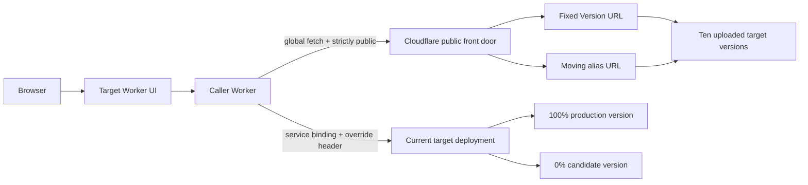

# Cloudflare Worker Version Routing

[](LICENSE)

> A Cloudflare Workers reference showing how one Worker can call ten individually addressable versions of another Worker over HTTP using Version URLs and `global_fetch_strictly_public`.

> **Status:** This is a reference implementation shared as-is. It is not actively maintained; support is best-effort through [GitHub Issues](../../issues).

**[Live Demo](https://pin.gryczka.dev/)**


The hosted page is the original account-specific experiment. This repository is its sanitized, reproducible reference implementation, with neutral Worker names and generated deployment metadata.

## What This Proves

A Worker with the [`global_fetch_strictly_public`](https://developers.cloudflare.com/workers/configuration/compatibility-flags/#global-fetch-strictly-public) compatibility flag can use global `fetch()` to reach another same-account Worker's public Version URLs:

```text
https://<first-8-version-characters>-<worker-name>.<subdomain>.workers.dev
```

Those fixed URLs can address uploaded versions that are not part of the current production deployment. The included bootstrap creates ten such versions, gives each a distinct `lab-01` through `lab-10` release label, and leaves all ten outside production traffic.

This is different from a version override. An override sent through a fetch-style service binding can select a 0% version, but only when that version belongs to the current deployment, which currently supports at most two versions.

## Architecture



The public-edge path is deliberate: without the compatibility flag, same-account `workers.dev` subrequests were rejected with Cloudflare error 1042 in this test. The service-binding path remains separate because it is the documented Worker-to-Worker mechanism for `Cloudflare-Workers-Version-Overrides`.

## Behavior Matrix

| Route | Selection guarantee | Live result |
| --- | --- | --- |
| Fixed Version URL plus global `fetch()` | One exact uploaded version | HTTP 200 for ten versions outside production traffic |
| Aliased Version URL plus global `fetch()` | Whichever upload the alias currently references | HTTP 200 with the executing version ID |
| Fetch-style service binding plus override header | A version in the current deployment, including 0% | HTTP 200 for the candidate |
| Production URL without an override | The active production traffic split | HTTP 200 |
| Preview custom domain from the caller | No successful call observed in the hosted test | Cloudflare error 1053, while direct browser requests returned 200 |

The custom-domain Preview result is an observed platform behavior, not a general contract. The reproducible public setup uses Version URLs and aliased Version URLs on `workers.dev`.

## Features

- Reproducible bootstrap for a target Worker, caller Worker, 0% candidate, and ten fixed lab versions
- Strict caller input validation that constructs only target-owned hostnames
- Interactive response inspector showing the requested URL, target release, and exact version ID
- Side-by-side demonstrations of fixed Version URLs, moving aliases, and current-deployment overrides
- Generated Wrangler binding types for both Workers
- Vitest validation plus Wrangler dry-run checks

## Tech Stack

| Layer | Technology |
| --- | --- |
| Runtime | Cloudflare Workers |
| Language | TypeScript |
| Deployment | Wrangler versions and deployments |
| Worker-to-Worker routing | Global `fetch()`, Version URLs, and a service binding |
| Testing | Vitest in the Workers runtime |

## Prerequisites

- Node.js 22.12 or newer (Node.js 24 is also tested)
- A Cloudflare account with a `workers.dev` subdomain
- Wrangler authentication (`npx wrangler login` or an appropriately scoped API token)
- Permission to deploy Workers in the selected account

If Wrangler can access more than one account, set `CLOUDFLARE_ACCOUNT_ID` in your shell before running the bootstrap. Do not commit account IDs or API tokens.

## Getting Started

### 1. Clone and install

```sh
git clone https://github.com/Gryczka/cloudflare-worker-version-routing.git
cd cloudflare-worker-version-routing
npm ci
```

### 2. Check the deployment plan

```sh
npm run bootstrap -- --dry-run
```

This authenticated, non-mutating check inspects Worker-name collisions and asks Wrangler to bundle both configurations. The real run discovers the selected account's `workers.dev` subdomain from Wrangler's deployment output. You do not enter or persist it in checked-in configuration.

### 3. Create the lab

```sh
npm run bootstrap
```

Before making changes, the bootstrap confirms Wrangler authentication and refuses to replace either fixed Worker name if it already exists. If you intentionally own a previous copy of this lab, inspect it first and add `--force` to the bootstrap command.

The ignored generated manifest is also the local ownership record for these fixed names. If setup is interrupted, keep that file and rerun with `--force`; the bootstrap can resume from a safely recorded partial state. If the manifest is lost, inspect and delete the two Workers manually rather than bypassing the ownership check.

The bootstrap performs these operations in order:

1. Deploys `worker-version-routing-target` with Version URLs enabled.
2. Uploads a `candidate` version and alias without promoting it.
3. Uploads ten labeled versions and aliases (`lab-01` through `lab-10`) without promoting them.
4. Writes the returned IDs to the ignored local file `workers/target/src/versions.generated.json`.
5. Deploys the target UI with that generated manifest.
6. Creates a deployment with the UI at 100% and candidate at 0%.
7. Deploys `worker-version-routing-caller` with its target service binding and public-routing flag.

Wrangler prints the target UI and caller API URLs when setup completes.

## Usage

Assume the caller is deployed at:

```text
https://worker-version-routing-caller.your-subdomain.workers.dev
```

Fetch production:

```sh
curl 'https://worker-version-routing-caller.your-subdomain.workers.dev/probe'
```

Fetch a fixed uploaded version using the full UUID captured in the generated manifest:

```sh
curl 'https://worker-version-routing-caller.your-subdomain.workers.dev/probe?uploaded=<version-uuid>'
```

Fetch a moving alias:

```sh
curl 'https://worker-version-routing-caller.your-subdomain.workers.dev/probe?alias=lab-10'
```

Select the 0% candidate through the service binding:

```sh
curl 'https://worker-version-routing-caller.your-subdomain.workers.dev/probe?version=<candidate-version-uuid>'
```

The caller never accepts an arbitrary destination URL. It validates a UUID or restricted alias and constructs a hostname under the configured target Worker and account subdomain.

## Updating The Deployment

After changing target code, preserve the generated candidate at 0%:

```sh
npm run deploy:target -- --force
```

After changing caller code:

```sh
npm run deploy:caller -- --force
```

Re-running `npm run bootstrap -- --force` creates a fresh candidate and ten fresh lab versions, then replaces the generated manifest. Production remains on its previous deployment until all uploads succeed and one final `versions deploy` operation applies the new 100%/0% split.

## Development And Verification

Generate binding types and type-check:

```sh
npm run typecheck
```

Run tests:

```sh
npm test
```

Bundle both Workers without deploying:

```sh
npm run deploy:dry-run
```

Run every local verification gate:

```sh
npm run check
```

Local development commands are also available as `npm run dev:target` and `npm run dev:caller`. The complete cross-Worker routing behavior requires deployed public Version URLs, so local development cannot reproduce every path.

## Configuration

| File | Purpose |
| --- | --- |
| `workers/target/wrangler.jsonc` | Target Worker, Version URL, observability, and version metadata settings |
| `workers/caller/wrangler.jsonc` | Caller service binding and `global_fetch_strictly_public` flag |
| `workers/target/src/versions.example.json` | Checked-in empty manifest template |
| `workers/target/src/versions.generated.json` | Ignored local version IDs produced by install/bootstrap |
| `scripts/bootstrap.mjs` | Initial target, version, deployment, and caller orchestration |
| `scripts/deploy-target.mjs` | Follow-up target deploy that restores the 100%/0% split |

The checked-in Wrangler values use the intentionally invalid `example.workers.dev` subdomain. The initial target deployment reveals the selected account's real subdomain; subsequent commands read it and the account ID from the ignored local manifest and refuse an account mismatch.

## Project Structure

```text
cloudflare-worker-version-routing/
├── docs/screenshots/             # Live demo image used by this README
├── scripts/
│   ├── bootstrap.mjs             # Creates the complete routing lab
│   ├── deploy-caller.mjs         # Deploys caller with derived origins
│   ├── deploy-target.mjs         # Deploys target and restores the split
│   ├── ensure-manifest.mjs       # Creates the ignored local manifest
│   └── wrangler.mjs              # Shared validated Wrangler helpers
├── test/index.spec.ts            # Caller input-validation tests
├── workers/
│   ├── caller/                   # HTTP routing and service-binding Worker
│   └── target/                   # Identity API and interactive UI Worker
├── package.json
└── vitest.config.mts
```

## Cleanup

The Worker names are intentionally fixed so the service binding and examples remain understandable. Delete the caller first, then the target:

```sh
npx wrangler delete worker-version-routing-caller
npx wrangler delete worker-version-routing-target
```

When more than one account is available, keep `CLOUDFLARE_ACCOUNT_ID` set during cleanup so Wrangler selects the intended account.

## Operational Notes

- Version URLs are public when enabled. Protect them with [Cloudflare Access](https://developers.cloudflare.com/workers/configuration/cloudflare-access/) if they should not be internet-accessible.
- `global_fetch_strictly_public` affects every global `fetch()` call in the caller. Same-zone requests traverse Cloudflare's public front door and can encounter public-edge security, caching, or routing behavior.
- Fixed Version URLs use each version's production resources and configuration. They are not isolated branch environments.
- Version URLs are unavailable for Workers implementing Durable Objects, including Containers and Sandbox Workers, and for Workers for Platforms user Workers.
- Aliases move when reassigned. Use a fixed URL when the destination must remain immutable.
- There is intentionally no one-click Deploy to Cloudflare button: the reference requires two Workers, sequential uploads, captured version IDs, and a staged deployment split.

## Documentation

- [Global fetch strictly public](https://developers.cloudflare.com/workers/configuration/compatibility-flags/#global-fetch-strictly-public)
- [Workers Fetch API](https://developers.cloudflare.com/workers/runtime-apis/fetch/)
- [Version URLs](https://developers.cloudflare.com/workers/versions-and-deployments/version-urls/)
- [Version overrides](https://developers.cloudflare.com/workers/versions-and-deployments/version-overrides/)
- [Service bindings](https://developers.cloudflare.com/workers/runtime-apis/bindings/service-bindings/)
- [Compare Workers testing workflows](https://developers.cloudflare.com/workers/previews/compare-workflows/)

## Contributing

Contributions are welcome. Read [CONTRIBUTING.md](CONTRIBUTING.md) for setup and pull-request guidance, and follow the [Code of Conduct](CODE_OF_CONDUCT.md).

## License

Licensed under the [MIT License](LICENSE).
